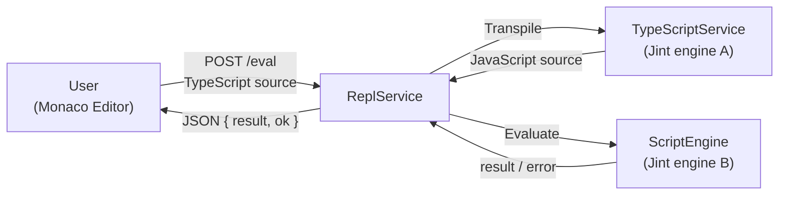
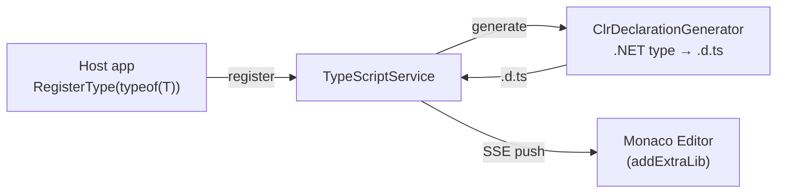

# Architecture Overview

Duets is an embeddable TypeScript console for .NET. It is designed to be added to any .NET application — including mobile, game engines, and other constrained environments — for live debugging and runtime scripting. The scripting language is TypeScript ([ADR-2](decisions/2_use-typescript-as-the-scripting-language.md)), which transpiles to JavaScript at eval time.

## Core Design Constraint

**No ASP.NET Core / Kestrel dependency.** Duets must remain embeddable in hosts that cannot or should not pull in the ASP.NET Core stack (e.g. Unity, Godot, .NET iOS/Android). The HTTP layer is built on `System.Net.HttpListener` via the HttpHarker library ([ADR-3](decisions/3_use-httplistener-instead-of-asp-net-core-kestrel.md), [ADR-9](decisions/9_wrap-httplistener-in-a-dedicated-middleware-library.md)).

## Module Structure

### Duets (core library)

The main library consists of four principal components plus a built-ins module:

- **TypeScriptService** — Hosts a Jint engine ([ADR-4](decisions/4_use-jint-as-the-javascript-engine.md)) that runs the official TypeScript compiler. Responsible for transpilation (TS → JS), managing type declarations, and streaming `.d.ts` updates via SSE. Downloads and caches `typescript.js` from unpkg at runtime ([ADR-6](decisions/6_fetch-and-cache-runtime-js-assets-from-cdn.md)). Provides `InjectStdLibAsync()` to optionally inject `lib.es5.d.ts` into the server-side language service for callers that use `GetCompletions` directly ([ADR-12](decisions/12_language-service-host-rewrite-and-nolib.md)).
- **BabelTranspiler** — Alternative `ITranspiler` implementation that runs `@babel/standalone` in a dedicated Jint engine ([ADR-19](decisions/19_babel-transpiler-as-typescript-7-migration-path.md)). Provides transpilation only (no language service or type declaration features) and serves as the migration path for TypeScript 7, which ships no JavaScript API.
- **ScriptEngine** — Hosts a separate Jint engine for executing user code ([ADR-5](decisions/5_separate-jint-engines-for-typescript-compiler-and-user-code.md)). Configured by the consumer to expose .NET assemblies and values. Requires an `ITranspiler` (e.g. `TypeScriptService`) at construction; `Execute`/`Evaluate` always transpile TypeScript before running ([ADR-10](decisions/10_extract-itranspiler-interface-for-scriptengine.md)).
- **ClrDeclarationGenerator** — Uses reflection to generate TypeScript type declarations (`.d.ts`) from .NET types. Declarations are pushed to the Monaco editor via SSE to enable completions ([ADR-8](decisions/8_use-addextralib-to-inject-dts-declarations-for-completions.md)).
- **ReplService** — Wires everything together into a web-based REPL ([ADR-7](decisions/7_use-monaco-editor-as-the-browser-based-repl-ui.md)). Serves the Monaco editor UI as embedded resources, provides an SSE endpoint for live type declaration updates, and a `POST /eval` endpoint that transpiles and executes code.
- **ScriptBuiltins / ScriptTypings** — Provides the `typings` global object and the `clrTypeOf` global function to scripts via `ScriptEngine.RegisterTypeBuiltins(TypeScriptService)`. `typings` exposes `useType`, `scanAssembly`, `scanAssemblyOf`, `useAssembly`, `useAssemblyOf`, and `useNamespace` for managing type declarations from within running scripts ([ADR-13](decisions/13_script-built-ins-and-typings-object.md), [ADR-14](decisions/14_assembly-derivation-from-type-reference.md), [ADR-15](decisions/15_namespace-skeleton-dummy-member.md)).

**Important:** TypeScriptService and ScriptEngine each own an independent Jint engine ([ADR-5](decisions/5_separate-jint-engines-for-typescript-compiler-and-user-code.md)). The TypeScript compiler engine must not be used to run user code, and vice versa.

### HttpHarker (HTTP server library)

A lightweight HTTP server built on `System.Net.HttpListener` with a middleware pipeline ([ADR-9](decisions/9_wrap-httplistener-in-a-dedicated-middleware-library.md)). It is a separate library with its own namespace and may be extracted into its own repository in the future. See [../src/HttpHarker/README.md](../src/HttpHarker/README.md) for details.

### Duets.Sandbox (developer / agent debugging CLI)

An internal console application for end-to-end verification of the Duets stack.
It is not intended for end users or as a deliverable ([ADR-11](decisions/11_sandbox-multi-mode-debugging-cli.md), [ADR-16](decisions/16_samples-directory-and-sandbox-role-clarification.md)). All commands use the fully-initialized `SandboxSession` (TypeScript engine, stdlib, `typings` built-ins, `AllowClr`). Modes:

| Mode | Invocation | Description |
|---|---|---|
| `repl` | *(default)* | Interactive REPL; TypeScript lines are evaluated, `:commands` manage state |
| `complete` | `complete <src> [--position n]` | One-shot completions at position; outputs a JSON object |
| `serve` | `serve [--port n]` | Starts the web REPL server; blocks until Ctrl+C |
| `batch` | `batch` | JSONL in → JSONL out; agent-friendly stateful session |

The batch mode is designed for use by AI coding agents: the agent writes a sequence of JSON operation objects to stdin and reads JSON results from stdout, with no background process management required.

### samples/ (usage examples)

Runnable file-based app examples (`.cs` files at repository root level) showing standard library usage ([ADR-16](decisions/16_samples-directory-and-sandbox-role-clarification.md)). Each file is self-contained and executable via `dotnet run samples/<file>.cs`. These are the recommended starting point for new users.

## Data Flow

### Eval (`POST /eval`)

### Type Registration (`SSE /type-declaration-events`)

## Runtime Dependencies

TypeScript compiler (`typescript.js`), Monaco Editor loader (`loader.js`), and optionally the ES5 standard library (`lib.es5.d.ts`) are fetched from unpkg on first use and cached in the system temp directory for 7 days ([ADR-6](decisions/6_fetch-and-cache-runtime-js-assets-from-cdn.md)). This avoids bundling large JS files in the library assembly. `lib.es5.d.ts` is only fetched when `InjectStdLibAsync()` is called ([ADR-12](decisions/12_language-service-host-rewrite-and-nolib.md)).

## Versioning and CI

Versions are managed by [Nerdbank.GitVersioning](https://github.com/dotnet/Nerdbank.GitVersioning) ([ADR-17](decisions/17_versioning-strategy-and-ci.md)). Releases are triggered by `v{major}.{minor}.{patch}` Git tags and publish a NuGet package to GitHub Packages. Development builds carry a `-dev.{height}+g{commit}` prerelease suffix (SemVer 2.0).

## Key Dependencies

| Package | Role |
|---|---|
| [Jint](https://github.com/sebastienros/jint) | JavaScript engine for running the TypeScript compiler and user scripts ([ADR-4](decisions/4_use-jint-as-the-javascript-engine.md)) |
| [Mio](https://github.com/takeshik/Mio) | File/directory path utilities for temp file caching |
| [Nerdbank.GitVersioning](https://github.com/dotnet/Nerdbank.GitVersioning) | Automated versioning from Git history and tags ([ADR-17](decisions/17_versioning-strategy-and-ci.md)) |
