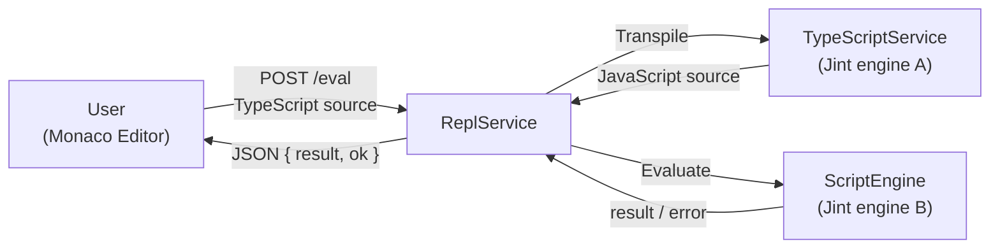
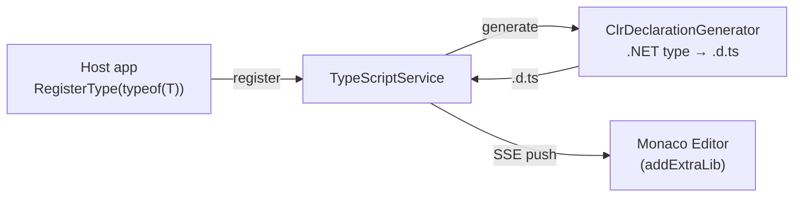

# Architecture Overview

Duets is an embeddable TypeScript console for .NET. It is designed to be added to any .NET application — including mobile, game engines, and other constrained environments — for live debugging and runtime scripting. The scripting language is TypeScript ([ADR-2](decisions/2_use-typescript-as-the-scripting-language.md)), which transpiles to JavaScript at eval time.

## Core Design Constraint

**No ASP.NET Core / Kestrel dependency.** Duets must remain embeddable in hosts that cannot or should not pull in the ASP.NET Core stack (e.g. Unity, Godot, .NET iOS/Android). The HTTP layer is built on `System.Net.HttpListener` via the HttpHarker library ([ADR-3](decisions/3_use-httplistener-instead-of-asp-net-core-kestrel.md), [ADR-9](decisions/9_wrap-httplistener-in-a-dedicated-middleware-library.md)).

## Module Structure

### Duets (core library)

The main library consists of four principal components:

- **TypeScriptService** — Hosts a Jint engine ([ADR-4](decisions/4_use-jint-as-the-javascript-engine.md)) that runs the official TypeScript compiler. Responsible for transpilation (TS → JS), managing type declarations, and streaming `.d.ts` updates via SSE. Downloads and caches `typescript.js` from unpkg at runtime ([ADR-6](decisions/6_fetch-and-cache-runtime-js-assets-from-cdn.md)).
- **ScriptEngine** — Hosts a separate Jint engine for executing user code ([ADR-5](decisions/5_separate-jint-engines-for-typescript-compiler-and-user-code.md)). Configured by the consumer to expose .NET assemblies and values. Requires an `ITranspiler` (e.g. `TypeScriptService`) at construction; `Execute`/`Evaluate` always transpile TypeScript before running ([ADR-10](decisions/10_extract-itranspiler-interface-for-scriptengine.md)).
- **ClrDeclarationGenerator** — Uses reflection to generate TypeScript type declarations (`.d.ts`) from .NET types. Declarations are pushed to the Monaco editor via SSE to enable completions ([ADR-8](decisions/8_use-addextralib-to-inject-dts-declarations-for-completions.md)).
- **ReplService** — Wires everything together into a web-based REPL ([ADR-7](decisions/7_use-monaco-editor-as-the-browser-based-repl-ui.md)). Serves the Monaco editor UI as embedded resources, provides an SSE endpoint for live type declaration updates, and a `POST /eval` endpoint that transpiles and executes code.

**Important:** TypeScriptService and ScriptEngine each own an independent Jint engine ([ADR-5](decisions/5_separate-jint-engines-for-typescript-compiler-and-user-code.md)). The TypeScript compiler engine must not be used to run user code, and vice versa.

### HttpHarker (HTTP server library)

A lightweight HTTP server built on `System.Net.HttpListener` with a middleware pipeline ([ADR-9](decisions/9_wrap-httplistener-in-a-dedicated-middleware-library.md)). It is a separate library with its own namespace and may be extracted into its own repository in the future. See [../src/HttpHarker/README.md](../src/HttpHarker/README.md) for details.

### Duets.Sandbox (sample application)

A minimal console application demonstrating how to wire up TypeScriptService, ScriptEngine, and ReplService with an HttpHarker server.

## Data Flow

### Eval (`POST /eval`)

### Type Registration (`SSE /type-declaration-events`)

## Runtime Dependencies

TypeScript compiler (`typescript.js`) and Monaco Editor loader (`loader.js`) are fetched from unpkg on first use and cached in the system temp directory for 7 days ([ADR-6](decisions/6_fetch-and-cache-runtime-js-assets-from-cdn.md)). This avoids bundling large JS files in the library assembly.

## Key Dependencies

| Package | Role |
|---|---|
| [Jint](https://github.com/sebastienros/jint) | JavaScript engine for running the TypeScript compiler and user scripts ([ADR-4](decisions/4_use-jint-as-the-javascript-engine.md)) |
| [Mio](https://github.com/takeshik/Mio) | File/directory path utilities for temp file caching |
