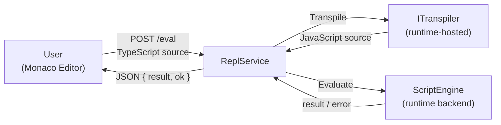
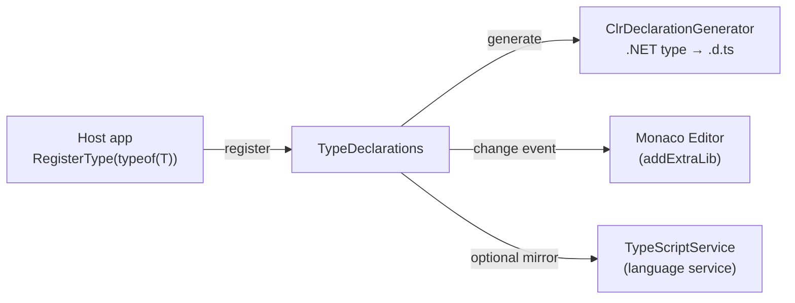

# Architecture Overview

Duets is an embeddable TypeScript console for .NET. It is designed to be added to any .NET application — including
mobile, game engines, and other constrained environments — for live debugging and runtime scripting. The scripting
language is TypeScript ([ADR-2](decisions/2_use-typescript-as-the-scripting-language.md)), which transpiles to
JavaScript at eval time.

## Core Design Constraint

**No ASP.NET Core / Kestrel dependency.** Duets must remain embeddable in hosts that cannot or should not pull in the ASP.NET Core stack (e.g. Unity, Godot, .NET iOS/Android). The HTTP layer is built on `System.Net.HttpListener` via the HttpHarker library ([ADR-3](decisions/3_use-httplistener-instead-of-asp-net-core-kestrel.md), [ADR-9](decisions/9_wrap-httplistener-in-a-dedicated-middleware-library.md)).

## Module Structure

### Duets (core library)

The main library consists of the following components:

- **DuetsSession** — Canonical entry point and top-level context ([ADR-25](decisions/25_session-as-canonical-entry-point.md), [ADR-27](decisions/27_split-javascript-runtime-backends-from-duets-core.md)). Owns `TypeDeclarations`, the active `ITranspiler`, an abstract `ScriptEngine`, and a `JsDocProviders` instance as a unit. `CreateAsync(Action<DuetsSessionConfiguration>?)` accepts an optional configuration callback; when neither engine nor transpiler is specified, defaults registered in `DuetsBackendRegistry` are used automatically ([ADR-28](decisions/28_unified-createasync-api-and-backend-autodiscovery.md)).
- **DuetsBackendRegistry** — Static registry for default engine and transpiler factories ([ADR-28](decisions/28_unified-createasync-api-and-backend-autodiscovery.md)). Backend packages register their defaults via `[ModuleInitializer]`-annotated methods on assembly load. `DuetsSession.CreateAsync` falls back to these defaults when no explicit configuration is provided.
- **TypeDeclarations** — Thread-safe, transpiler-agnostic runtime store for type declarations ([ADR-25](decisions/25_session-as-canonical-entry-point.md)). Owns CLR type registration, namespace placeholders, raw `.d.ts` registration, and change notifications. Exposes two narrow views: `ITypeDeclarationProvider` (snapshot + change events) and `ITypeDeclarationRegistrar` (registration commands). Uses `ClrDeclarationGenerator` internally.
- **ClrDeclarationGenerator** — Uses reflection to generate TypeScript type declarations (`.d.ts`) from .NET types. Accepts an optional `IJsDocProvider` to annotate members with prose documentation sourced from .NET XML doc comments. Called by `TypeDeclarations` when a CLR type is registered ([ADR-8](decisions/8_use-addextralib-to-inject-dts-declarations-for-completions.md), [ADR-29](decisions/29_jsdoc-provider-abstraction.md)).
- **JsDocProviders / IJsDocProvider** — Composite registry of documentation providers ([ADR-29](decisions/29_jsdoc-provider-abstraction.md)). Tries registered providers in order and returns the first non-null result; isolates per-provider exceptions. Raises `ProviderAdded` so that `DuetsSession` can trigger `TypeDeclarations.RefreshDeclarations` when new documentation becomes available.
- **XmlDocumentationProvider** — `IJsDocProvider` backed by a .NET XML documentation file ([ADR-29](decisions/29_jsdoc-provider-abstraction.md)). Can download and cache a NuGet nupkg to extract the XML file, selecting the best TFM match and a specific assembly name in multi-assembly packages.
- **ITranspiler** — Engine-neutral transpilation boundary ([ADR-10](decisions/10_extract-itranspiler-interface-for-scriptengine.md), [ADR-27](decisions/27_split-javascript-runtime-backends-from-duets-core.md)). Concrete implementations may be hosted by different JavaScript runtimes or replaced by future wasm-backed approaches.
- **ScriptEngine** — Abstract runtime-neutral execution facade ([ADR-27](decisions/27_split-javascript-runtime-backends-from-duets-core.md)). `Execute` and `Evaluate` always transpile before running, track `$_` and `$exception`, expose console events, and surface runtime values through `ScriptValue` instead of engine-specific value types.
- **ScriptValue** — Runtime-neutral wrapper around a JavaScript value ([ADR-27](decisions/27_split-javascript-runtime-backends-from-duets-core.md), [ADR-30](decisions/30_scriptvalue-redesign-abstract-class-and-jstype.md)). Abstract class; backend packages provide concrete subclasses (e.g. `JintScriptValue`). Exposes `ToObject` and `ToString`. `==`/`!=` operators work correctly across sentinel (`ScriptValue.Undefined`, `ScriptValue.Null`) and engine-backed values; cross-backend comparisons throw.
- **ReplService** — Wires everything together into a web-based REPL ([ADR-7](decisions/7_use-monaco-editor-as-the-browser-based-repl-ui.md)). Serves the Monaco editor UI as embedded resources, provides an SSE endpoint for live type declaration updates, and a `POST /eval` endpoint that transpiles and executes code. Depends on `ITypeDeclarationProvider` for the declaration SSE stream, not on a specific runtime backend.

### Duets.Jint

The Jint integration package provides the Jint-backed runtime implementation
([ADR-27](decisions/27_split-javascript-runtime-backends-from-duets-core.md)):

- **JintScriptEngine** — Concrete `ScriptEngine` backed by Jint. Manages the user script execution environment, CLR interop via `AllowClr`, and wires `ExtensionMethodRegistry` into the Jint `MemberAccessor` hook ([ADR-26](decisions/26_extension-method-support-via-member-accessor-hook.md)).
- **TypeScriptService** — Hosts the official TypeScript compiler (`typescript.js`) in a dedicated Jint engine instance separate from user code, providing both transpilation and server-side completions ([ADR-5](decisions/5_separate-jint-engines-for-typescript-compiler-and-user-code.md), [ADR-12](decisions/12_language-service-host-rewrite-and-nolib.md)).
- **BabelTranspiler** — `ITranspiler` implementation backed by `@babel/standalone` running in Jint; the forward-compatibility path for TypeScript 7 ([ADR-19](decisions/19_babel-transpiler-as-typescript-7-migration-path.md)).
- **ScriptTypings** — Provides the `typings` global object in the script environment, exposing type registration APIs (`importType`, `importAssembly`, `usingNamespace`, `addExtensionMethods`, etc.) ([ADR-13](decisions/13_script-built-ins-and-typings-object.md), [ADR-24](decisions/24_typings-api-redesign.md)).
- **ExtensionMethodRegistry** — Thread-safe registry for runtime extension method dispatch via Jint's `MemberAccessor` hook ([ADR-26](decisions/26_extension-method-support-via-member-accessor-hook.md)).
- **DuetsSessionConfigurationExtensions** — Provides `UseJint()` and `UseBabel()` on `DuetsSessionConfiguration` ([ADR-28](decisions/28_unified-createasync-api-and-backend-autodiscovery.md)). `UseJint()` selects the Jint engine; `UseBabel()` selects the Babel transpiler. Both are optional when `JintBackendInitializer` has already registered the defaults.
- **JintBackendInitializer** — Registers `JintScriptEngine` and `BabelTranspiler` as the default engine and transpiler in `DuetsBackendRegistry` via `[ModuleInitializer]`, enabling zero-configuration `DuetsSession.CreateAsync()` for any caller that references `Duets.Jint` ([ADR-28](decisions/28_unified-createasync-api-and-backend-autodiscovery.md)).

### HttpHarker (HTTP server library)

A lightweight HTTP server built on `System.Net.HttpListener` with a middleware pipeline ([ADR-9](decisions/9_wrap-httplistener-in-a-dedicated-middleware-library.md)). It is a separate library with its own namespace and may be extracted into its own repository in the future. See [../src/HttpHarker/README.md](../src/HttpHarker/README.md) for details.

### Duets.Sandbox (developer / agent debugging CLI)

An internal console application for end-to-end verification of the Duets stack.
It is not intended for end users or as a deliverable ([ADR-11](decisions/11_sandbox-multi-mode-debugging-cli.md), [ADR-16](decisions/16_samples-directory-and-sandbox-role-clarification.md)). All commands run against a fully-initialized TypeScript engine with stdlib, `typings` built-ins, and `AllowClr`. Modes:

| Mode | Invocation | Description |
|---|---|---|
| `repl` | *(default)* | Interactive REPL; TypeScript lines are evaluated, `:commands` manage state |
| `complete` | `complete <src> [--position n]` | One-shot completions at position; outputs a JSON object |
| `serve` | `serve [--port n]` | Starts the web REPL server; blocks until Ctrl+C |
| `batch` | `batch` | JSONL in → JSONL out; agent-friendly stateful session |

The batch mode is designed for use by AI coding agents: the agent writes a sequence of JSON operation objects to stdin and reads JSON results from stdout, with no background process management required.

### samples/ (usage examples)

Runnable file-based app examples (`.cs` files at repository root level) showing standard library usage ([ADR-16](decisions/16_samples-directory-and-sandbox-role-clarification.md)). Each file is self-contained and executable via `dotnet run samples/<file>.cs`. These are the recommended starting point for new users.

## Data Flow

### Eval (`POST /eval`)

### Type Registration (`SSE /type-declaration-events`)

## Runtime Dependencies

TypeScript compiler (`typescript.js`), Monaco Editor loader (`loader.js`), and optionally the ES5 standard library
(`lib.es5.d.ts`) are fetched from unpkg on first use and cached in the system temp directory for 7 days
([ADR-6](decisions/6_fetch-and-cache-runtime-js-assets-from-cdn.md), [ADR-18](decisions/18_pluggable-asset-source-abstraction.md)).
This avoids bundling large JS files in the library assembly. `lib.es5.d.ts` is only fetched when a runtime-hosted
`TypeScriptService` injects it for server-side completions ([ADR-12](decisions/12_language-service-host-rewrite-and-nolib.md)).

## Versioning and CI

Versions are managed by [Nerdbank.GitVersioning](https://github.com/dotnet/Nerdbank.GitVersioning) ([ADR-17](decisions/17_versioning-strategy-and-ci.md)). Releases are triggered by `v{major}.{minor}.{patch}` Git tags and publish a NuGet package to GitHub Packages. Development builds carry a `-dev.{height}+g{commit}` prerelease suffix (SemVer 2.0).

## Key Dependencies

| Package | Role |
|---|---|
| [Jint](https://github.com/sebastienros/jint) | JavaScript runtime backend used by `Duets.Jint` ([ADR-4](decisions/4_use-jint-as-the-javascript-engine.md), [ADR-27](decisions/27_split-javascript-runtime-backends-from-duets-core.md)) |
| [Nerdbank.GitVersioning](https://github.com/dotnet/Nerdbank.GitVersioning) | Automated versioning from Git history and tags ([ADR-17](decisions/17_versioning-strategy-and-ci.md)) |
