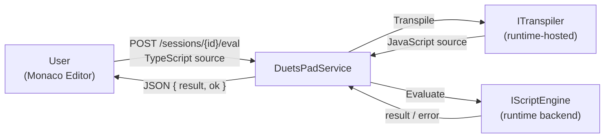
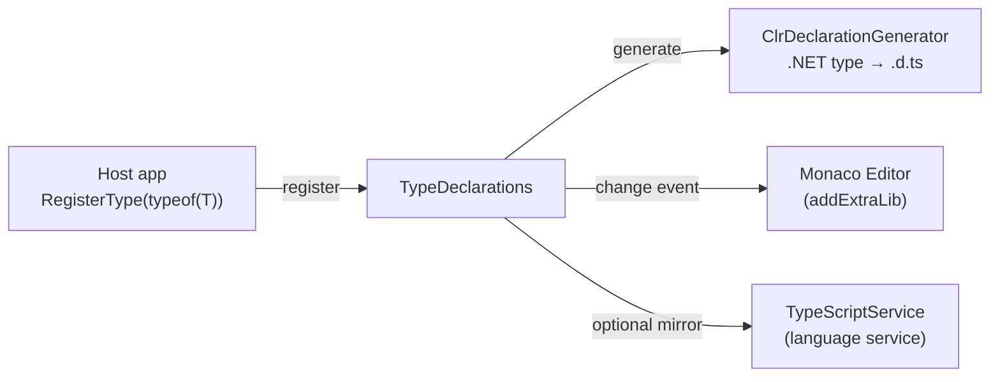

# Architecture Overview

Duets is an embeddable TypeScript console for .NET. It is designed to be added to any .NET application — including
mobile, game engines, and other constrained environments — for live debugging and runtime scripting. The scripting
language is TypeScript ([ADR-2](decisions/2_use-typescript-as-the-scripting-language.md)), which transpiles to
JavaScript at eval time.

## Core Design Constraint

**No ASP.NET Core / Kestrel dependency.** Duets must remain embeddable in hosts that cannot or should not pull in the ASP.NET Core stack (e.g. Unity, Godot, .NET iOS/Android). The HTTP layer is built on `System.Net.HttpListener` via the HttpHarker library ([ADR-3](decisions/3_use-httplistener-instead-of-asp-net-core-kestrel.md), [ADR-9](decisions/9_wrap-httplistener-in-a-dedicated-middleware-library.md)).

## Module Structure

### Duets (core library)

The main library consists of the following components:

- **DuetsSession** — Canonical entry point and top-level context ([ADR-25](decisions/25_session-as-canonical-entry-point.md), [ADR-27](decisions/27_split-javascript-runtime-backends-from-duets-core.md)). Owns `TypeDeclarations`, the active `ITranspiler`, an `IScriptEngine`, a `JsDocProviders` instance, and a tagged-template completion registry as a unit. `CreateAsync(Action<DuetsSessionConfiguration>?)` accepts an optional configuration callback; when neither engine nor transpiler is specified, defaults registered in `DuetsBackendRegistry` are used automatically ([ADR-28](decisions/28_unified-createasync-api-and-backend-autodiscovery.md)). `RegisterTaggedTemplate` records host completion callbacks in the core registry and independently asks a supporting backend to install a runtime tagged-template function only when an evaluator is provided ([ADR-44](decisions/44_tagged-template-completion-rpc-boundary.md)).
- **DuetsBackendRegistry** — Static registry for default engine and transpiler factories ([ADR-28](decisions/28_unified-createasync-api-and-backend-autodiscovery.md)). Backend packages register their defaults via `[ModuleInitializer]`-annotated methods on assembly load. `DuetsSession.CreateAsync` falls back to these defaults when no explicit configuration is provided.
- **TypeDeclarations** — Thread-safe, transpiler-agnostic runtime store for type declarations ([ADR-25](decisions/25_session-as-canonical-entry-point.md)). Owns CLR type registration, namespace placeholders, raw `.d.ts` registration, and change notifications. Exposes two narrow views: `ITypeDeclarationProvider` (snapshot + change events) and `ITypeDeclarationRegistrar` (registration commands). Uses `ClrDeclarationGenerator` internally.
- **ClrDeclarationGenerator** — Uses reflection to generate TypeScript type declarations (`.d.ts`) from .NET types. Accepts an optional `IJsDocProvider` to annotate members with prose documentation sourced from .NET XML doc comments. Called by `TypeDeclarations` when a CLR type is registered ([ADR-8](decisions/8_use-addextralib-to-inject-dts-declarations-for-completions.md), [ADR-29](decisions/29_jsdoc-provider-abstraction.md)).
- **JsDocProviders / IJsDocProvider** — Composite registry of documentation providers ([ADR-29](decisions/29_jsdoc-provider-abstraction.md)). Tries registered providers in order and returns the first non-null result; isolates per-provider exceptions. Raises `ProviderAdded` so that `DuetsSession` can trigger `TypeDeclarations.RefreshDeclarations` when new documentation becomes available.
- **XmlDocumentationProvider** — `IJsDocProvider` backed by a .NET XML documentation file ([ADR-29](decisions/29_jsdoc-provider-abstraction.md)). Can download and cache a NuGet nupkg to extract the XML file, selecting the best TFM match and a specific assembly name in multi-assembly packages.
- **ITranspiler** — Engine-neutral transpilation boundary ([ADR-10](decisions/10_extract-itranspiler-interface-for-scriptengine.md), [ADR-27](decisions/27_split-javascript-runtime-backends-from-duets-core.md)). Concrete implementations may be hosted by different JavaScript runtimes or replaced by future wasm-backed approaches.
- **IScriptEngine** — Runtime-neutral execution contract ([ADR-27](decisions/27_split-javascript-runtime-backends-from-duets-core.md), [ADR-31](decisions/31_scriptengine-generic-backend-base-and-iscriptengine.md)). Interface held by callers (`DuetsSession`, `DuetsPadSession`, factory delegates). `Execute` and `Evaluate` always transpile before running, track `$_` and `$exception`, expose console events, and surface runtime values through `ScriptValue` instead of engine-specific value types. Backend packages implement `ScriptEngine<TValue>`, not `IScriptEngine` directly.
- **ScriptEngine&lt;TValue&gt;** — Generic abstract base for backend implementations ([ADR-31](decisions/31_scriptengine-generic-backend-base-and-iscriptengine.md)). Holds an `IScriptValueConverter<TValue>` and uses it to implement `SetValue(string, ScriptValue)` and `Evaluate*` result wrapping concretely; backends only implement the engine-specific hooks (`SetValue(string, TValue)`, `EvaluateJs`, `ExecuteJs`, etc.).
- **IScriptValueConverter&lt;T&gt;** — Bidirectional converter between `ScriptValue` and a backend's internal value type ([ADR-31](decisions/31_scriptengine-generic-backend-base-and-iscriptengine.md)). `Wrap(T)` produces a `ScriptValue`; `Unwrap(ScriptValue)` recovers the internal value. The two directions are kept in one interface because `T` is fixed per backend and variance provides no practical benefit.
- **ScriptValue** — Runtime-neutral wrapper around a JavaScript value ([ADR-27](decisions/27_split-javascript-runtime-backends-from-duets-core.md), [ADR-30](decisions/30_scriptvalue-redesign-abstract-class-and-jstype.md)). Abstract class; backend packages provide concrete subclasses (e.g. `JintScriptValue`). Exposes `ToObject` and `ToString`. `==`/`!=` operators work correctly across sentinel (`ScriptValue.Undefined`, `ScriptValue.Null`) and engine-backed values; cross-backend comparisons throw.
- **DuetsPad** (`Duets.Pad` namespace) — Browser debug pad that supersedes `ReplService`, reuses the Monaco and TypeScript infrastructure from the browser REPL, and provides the top-level surfaces defined by ADR-32 ([ADR-32](decisions/32_duetspad-supersede-replservice-with-new-output-model.md), [ADR-7](decisions/7_use-monaco-editor-as-the-browser-based-repl-ui.md)). `DuetsPadService` is a thin HTTP router that attaches to an `HttpServer` via `UseDuetsPad` and delegates to three collaborators: **`SessionRegistry`** owns the session table, server-issued identifiers, create/lookup/delete, disposal, and idle reclamation (cleanup timer + idle sweep); **`AssetProvider`** owns static-asset acquisition, caching, serving, and the Tabler Icons CSS rewrite; and **`SseTransport`** is the single SSE streaming primitive behind the one multiplexed per-session event stream (`GET /sessions/{sessionId}/events`) that carries the canvas, timeline, type-declaration, tagged-template tag snapshots, and control events, rather than one stream per surface ([ADR-36](decisions/36_duetspad-server-canonical-output-protocol.md), [ADR-44](decisions/44_tagged-template-completion-rpc-boundary.md)). `/sessions/{sessionId}/complete` is a bounded RPC endpoint to registered tagged-template completion providers: the Monaco client uses Monaco tokenization plus narrow helper logic to decide when to ask and sends explicit segment context, while the server validates the registered tag, normalizes the single accepted raw segment, enforces resource limits, caps results, and checks segment-relative replacement spans without parsing JavaScript source ([ADR-44](decisions/44_tagged-template-completion-rpc-boundary.md)). Each `DuetsPadSession` is slimmed to the eval gate, state nucleus, and subscriber fan-out: it wraps one `DuetsSession` and owns its named canvases (the `canvases` script global exposes `get(name)` with getOrAdd semantics; the `canvas` global aliases the always-present `"default"` canvas), Timeline, object renderers, script globals, SSE subscribers, and a per-session interaction store (canvas interactions keyed by canvas name), while construction-time script-global wiring is performed by **`SessionBootstrap`** and rendering funnels through a single `TryRenderContent` entry point ([ADR-34](decisions/34_duetspad-session-ownership-and-isolation.md)). Sessions are disposed explicitly via `DELETE /sessions/{sessionId}` and reclaimed by the registry after a configurable idle timeout (evaluation and SSE keepalive/stream activity count as activity); disposed identifiers are never reused and browser disconnect alone does not dispose a session ([ADR-38](decisions/38_duetspad-session-lifecycle.md)). Canvas and Timeline state is authoritative on the server, represented as reduced render nodes, and projected to the browser over namespaced SSE protocol events ([ADR-35](decisions/35_duetspad-rendering-model.md), [ADR-36](decisions/36_duetspad-server-canonical-output-protocol.md)). A session may hold multiple named canvases; the `canvas.snapshot`/`canvas.replace` events carry a `name` field and the initial burst emits one snapshot per canvas, while the browser Canvas pane is tabbed (sub-tabs in split view, promoted to flat top-level tabs in tabbed view) ([ADR-43](decisions/43_duetspad-named-multi-canvas.md)). CLR values are rendered through a `RenderContext` that carries per-call dump options (`DumpOptions` — `MaxDepth`=5/`MaxItems`=1000 limits) and centralizes depth limiting and cycle detection in the dispatch step; rendering produces `DisplayContent` (a terminal body plus its interactions), keeping the stored render-node tree display-only; `dump` is a DuetsPad-only global (core Duets surfaces values as the evaluation result plus `console`/`util.inspect`) ([ADR-35](decisions/35_duetspad-rendering-model.md)). `ui.button` and similar attach server-side handlers that the browser triggers by opaque handler id via `POST /sessions/{sessionId}/interactions/{handlerId}/invoke` (answered `stale` when the handler's output has already been retired), and the interaction store releases handlers when their Canvas/Timeline output is replaced, trimmed, or the session is disposed ([ADR-41](decisions/41_duetspad-interaction-model.md)). A `pad` script global lets scripts operate the pad itself: `pad.resetSession`, `pad.openText`, and `pad.setEditorText` enqueue `control.*` commands buffered during a run and flushed afterward under the eval gate, over the same multiplexed stream; reset is browser-driven as a no-reload session swap, and `openText` presents an open action (the text handed off out-of-band via a one-shot key, never in the URL) with a popup-block toast fallback ([ADR-42](decisions/42_duetspad-pad-control-surface-and-command-channel.md)). The Timeline is bounded by an opt-in entry-count quota (`TimelineEntryLimit`, `null` = unlimited): the server drops oldest entries after an append and emits `timeline.append` then `timeline.trim`, preserving entry-id monotonicity so the browser projection converges ([ADR-39](decisions/39_duetspad-timeline-quota-policy.md)).

### Duets.Jint

The Jint integration package provides the Jint-backed runtime implementation
([ADR-27](decisions/27_split-javascript-runtime-backends-from-duets-core.md)):

- **JintScriptEngine** — Concrete `ScriptEngine<JsValue>` backed by Jint. Manages the user script execution environment, CLR interop via `AllowClr`, and wires `ExtensionMethodRegistry` into the Jint `MemberAccessor` hook ([ADR-26](decisions/26_extension-method-support-via-member-accessor-hook.md)).
- **TypeScriptService** — Hosts the official TypeScript compiler (`typescript.js`) in a dedicated Jint engine instance separate from user code, providing both transpilation and server-side completions ([ADR-5](decisions/5_separate-jint-engines-for-typescript-compiler-and-user-code.md), [ADR-12](decisions/12_language-service-host-rewrite-and-nolib.md)).
- **BabelTranspiler** — `ITranspiler` implementation backed by `@babel/standalone` running in Jint; the forward-compatibility path for TypeScript 7 ([ADR-19](decisions/19_babel-transpiler-as-typescript-7-migration-path.md)).
- **ScriptTypings** — Provides the `typings` global object in the script environment, exposing type registration APIs (`importType`, `importAssembly`, `usingNamespace`, `addExtensionMethods`, etc.) ([ADR-13](decisions/13_script-built-ins-and-typings-object.md), [ADR-24](decisions/24_typings-api-redesign.md)).
- **ExtensionMethodRegistry** — Thread-safe registry for runtime extension method dispatch via Jint's `MemberAccessor` hook ([ADR-26](decisions/26_extension-method-support-via-member-accessor-hook.md)).
- **DuetsSessionConfigurationExtensions** — Provides `UseJint()` and `UseBabel()` on `DuetsSessionConfiguration` ([ADR-28](decisions/28_unified-createasync-api-and-backend-autodiscovery.md)). `UseJint()` selects the Jint engine; `UseBabel()` selects the Babel transpiler. Both are optional when `JintBackendInitializer` has already registered the defaults.
- **JintBackendInitializer** — Registers `JintScriptEngine` and `BabelTranspiler` as the default engine and transpiler in `DuetsBackendRegistry` via `[ModuleInitializer]`, enabling zero-configuration `DuetsSession.CreateAsync()` for any caller that references `Duets.Jint` ([ADR-28](decisions/28_unified-createasync-api-and-backend-autodiscovery.md)).

### HttpHarker (HTTP server library)

A lightweight HTTP server built on `System.Net.HttpListener` with a middleware pipeline ([ADR-9](decisions/9_wrap-httplistener-in-a-dedicated-middleware-library.md)). It is a separate library with its own namespace and may be extracted into its own repository in the future. See [../src/HttpHarker/README.md](../src/HttpHarker/README.md) for details.

### Duets.Sandbox (developer / agent debugging CLI)

An internal console application for end-to-end verification of the Duets stack.
It is not intended for end users or as a deliverable ([ADR-11](decisions/11_sandbox-multi-mode-debugging-cli.md), [ADR-16](decisions/16_samples-directory-and-sandbox-role-clarification.md)). All commands run against a fully-initialized TypeScript engine with stdlib, `typings` built-ins, and `AllowClr`. Modes:

| Mode | Invocation | Description |
|---|---|---|
| `repl` | *(default)* | Interactive REPL; TypeScript lines are evaluated, `:commands` manage state |
| `complete` | `complete <src> [--position n]` | One-shot completions at position; outputs a JSON object |
| `serve` | `serve [--port n]` | Starts the DuetsPad web server; blocks until Ctrl+C |
| `batch` | `batch` | JSONL in → JSONL out; agent-friendly stateful session |

The batch mode is designed for use by AI coding agents: the agent writes a sequence of JSON operation objects to stdin and reads JSON results from stdout, with no background process management required.

### samples/ (usage examples)

Runnable file-based app examples (`.cs` files at repository root level) showing standard library usage ([ADR-16](decisions/16_samples-directory-and-sandbox-role-clarification.md)). Each file is self-contained and executable via `dotnet run samples/<file>.cs`. These are the recommended starting point for new users.

## Data Flow

### Eval (`POST /sessions/{sessionId}/eval`)

```mermaid
flowchart LR
    U["User\n(Monaco Editor)"]
    PS[DuetsPadService]
    TS["ITranspiler\n(runtime-hosted)"]
    SE["IScriptEngine\n(runtime backend)"]

    U -->|"POST /sessions/{id}/eval\nTypeScript source"| PS
    PS -->|Transpile| TS
    TS -->|JavaScript source| PS
    PS -->|Evaluate| SE
    SE -->|result / error| PS
    PS -->|"JSON { result, ok }"| U
```

### Type Registration (`type.declaration` events on `SSE /sessions/{sessionId}/events`)

```mermaid
flowchart LR
    Host["Host app\nRegisterType(typeof(T))"] -->|register| TD[TypeDeclarations]
    TD -->|generate| CG["ClrDeclarationGenerator\n.NET type → .d.ts"]
    TD -->|"change event"| Monaco["Monaco Editor\n(addExtraLib)"]
    TD -->|"optional mirror"| TS["TypeScriptService\n(language service)"]
```

## Runtime Dependencies

TypeScript compiler (`typescript.js`), Monaco Editor loader (`loader.js`), and optionally the ES5 standard library
(`lib.es5.d.ts`) are fetched from unpkg on first use and cached in the system temp directory for 7 days
([ADR-6](decisions/6_fetch-and-cache-runtime-js-assets-from-cdn.md), [ADR-18](decisions/18_pluggable-asset-source-abstraction.md)).
This avoids bundling large JS files in the library assembly. `lib.es5.d.ts` is only fetched when a runtime-hosted
`TypeScriptService` injects it for server-side completions ([ADR-12](decisions/12_language-service-host-rewrite-and-nolib.md)).

## Versioning and CI

Versions are managed by [Nerdbank.GitVersioning](https://github.com/dotnet/Nerdbank.GitVersioning) ([ADR-23](decisions/23_ci-and-package-publishing.md)). Releases are triggered by `v{major}.{minor}.{patch}` Git tags and publish a NuGet package to GitHub Packages. Development builds carry a `-dev.{height}+g{commit}` prerelease suffix (SemVer 2.0).

## Key Dependencies

| Package | Role |
|---|---|
| [Jint](https://github.com/sebastienros/jint) | JavaScript runtime backend used by `Duets.Jint` ([ADR-4](decisions/4_use-jint-as-the-javascript-engine.md), [ADR-27](decisions/27_split-javascript-runtime-backends-from-duets-core.md)) |
| [Nerdbank.GitVersioning](https://github.com/dotnet/Nerdbank.GitVersioning) | Automated versioning from Git history and tags ([ADR-23](decisions/23_ci-and-package-publishing.md)) |
