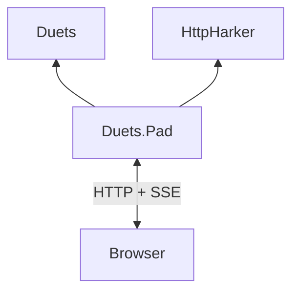

# Duets.Pad Architecture

DuetsPad is the browser debug pad shipped by the `Duets.Pad` package. It combines a Monaco editor with persistent
structured output and server-side interactions, while remaining optional for hosts that need only the runtime-neutral
[`Duets`](../Duets.md) core.

The [DuetsPad package guide](../../../src/Duets.Pad/README.md) owns installation, getting started, surface behavior,
UI-builder guidance, configuration, and deployment instructions. This documentation set owns the current internal
architecture:

- [Protocol](protocol.md) — HTTP endpoints, the multiplexed SSE stream, projection events, completion RPC, and
  synchronization ordering.
- [Rendering and state](rendering-and-state.md) — render nodes, output surfaces, interactions, fields, attachments,
  modals, and their lifetimes.
- [Security](security.md) — threat model, authentication boundary, frontend trust, and resource ceilings.

See the [repository architecture](../README.md) for the complete package graph and the
[ADR index](../../decisions/index.md) for decision rationale.

## Product model

DuetsPad supersedes the earlier browser `ReplService`. Its vocabulary separates authoring, persistent display state,
history, modal interaction, and lightweight probing
([ADR-7](../../decisions/7_use-monaco-editor-as-the-browser-based-repl-ui.md),
[ADR-32](../../decisions/32_duetspad-supersede-replservice-with-new-output-model.md),
[ADR-52](../../decisions/52_duetspad-modal-surface.md)):

- **Editor** is the Monaco script-authoring surface with TypeScript completions.
- **Canvas** is persistent structured display state. One session can own several named canvases.
- **Timeline** is structured history for `dump`, console output, Immediate results, diagnostics, and rendering errors.
- **Modal** is server-canonical content for interactions that complete in a later browser turn.
- **Immediate** is a single-line evaluation input whose results are appended to the Timeline.

Canvas, Timeline, and Modal are server-canonical projections. The Editor remains browser-owned; the server can issue
set-only editor commands but does not retain a live editor buffer
([ADR-36](../../decisions/36_duetspad-server-canonical-output-protocol.md),
[ADR-42](../../decisions/42_duetspad-pad-control-surface-and-command-channel.md),
[ADR-52](../../decisions/52_duetspad-modal-surface.md)).

## Package boundary

`Duets.Pad` depends on `Duets` and [`HttpHarker`](../HttpHarker.md). It contains the pad service, session wrapper,
rendering and interaction state, protocol messages, and embedded browser assets. The core package contains none of
those HTTP or browser concerns. The pad consumes the public core API without an `InternalsVisibleTo` grant from
`Duets`
([ADR-48](../../decisions/48_extract-duets-pad-into-its-own-package.md)).

## Service composition

`DuetsPadService` is a thin HTTP router attached to an HttpHarker `HttpServer` through `UseDuetsPad`. It delegates
long-lived responsibilities instead of owning them directly
([ADR-34](../../decisions/34_duetspad-session-ownership-and-isolation.md)):

- **`SessionRegistry`** owns the session table, server-issued opaque identifiers, explicit create/lookup/delete,
  disposal, and idle reclamation.
- **`AssetProvider`** acquires, caches, rewrites where necessary, and serves the embedded or externally sourced browser
  assets.
- **`SseTransport`** owns the mechanics shared by SSE responses: headers, the event channel, keepalive, disconnect,
  and teardown. A session supplies the subscriber state and replay operation.

Authentication is installed ahead of the router and gates the entire `/sessions` subtree by path. Static UI assets
remain outside that gate so an unauthenticated browser can load the token prompt. The complete boundary is documented
under [security](security.md).

## Session ownership

Each `DuetsPadSession` wraps exactly one core `DuetsSession` and is the isolation boundary for one server-side browser
session. It owns the evaluation gate, named Canvases, Timeline, active Modals, renderers, script globals, SSE
subscribers, interactions, form fields, attachment state, and queued control commands
([ADR-34](../../decisions/34_duetspad-session-ownership-and-isolation.md),
[ADR-41](../../decisions/41_duetspad-interaction-model.md),
[ADR-42](../../decisions/42_duetspad-pad-control-surface-and-command-channel.md),
[ADR-47](../../decisions/47_duetspad-form-input-state-model.md),
[ADR-50](../../decisions/50_duetspad-file-attachment-state-and-upload-protocol.md),
[ADR-52](../../decisions/52_duetspad-modal-surface.md)).

`SessionBootstrap` wires construction-time globals such as `canvas`, `canvases`, `ui`, `pad`, and `dump`, and installs
their declarations into the core session. It retains no independent runtime state after construction. Rendering
enters through one session-level `TryRenderContent` path so Canvas, Timeline, Modal, interactions, and resource
lifetime rules observe the same render result
([ADR-34](../../decisions/34_duetspad-session-ownership-and-isolation.md),
[ADR-35](../../decisions/35_duetspad-rendering-model.md)).

Evaluation and state-changing callbacks are serialized by the session's evaluation gate. The completion callback
boundary has its own bounded execution policy so editor completion does not become general source evaluation
([ADR-41](../../decisions/41_duetspad-interaction-model.md),
[ADR-44](../../decisions/44_tagged-template-completion-rpc-boundary.md)).

## Session lifecycle

Sessions are created explicitly and disposed explicitly through `DELETE /sessions/{sessionId}`. Server-issued
identifiers are never reused. Browser disconnect alone does not dispose a session because reload and reconnect must
recover server-canonical output. `SessionRegistry` reclaims a session after its configurable idle timeout; evaluation,
SSE stream activity, and keepalive activity count as use. Multiple browsers attached to one session are tolerated by
the fan-out model but are not a first-class shared-editing contract
([ADR-38](../../decisions/38_duetspad-session-lifecycle.md)).

The browser stores its current session identifier in `sessionStorage`. If that identifier is no longer live, it uses
the explicit creation route to obtain a fresh server-issued identifier rather than causing an unknown identifier to
be created implicitly
([ADR-34](../../decisions/34_duetspad-session-ownership-and-isolation.md),
[ADR-38](../../decisions/38_duetspad-session-lifecycle.md)).

## State and transport boundary

State-owning components produce immutable projection messages; the browser applies those messages and sends bounded
commands or state snapshots back through explicit HTTP endpoints. The division is:

| Concern | Canonical owner |
|---|---|
| Canvas, Timeline, Modal contents and retained resources | [Rendering and state](rendering-and-state.md) |
| Event names, revisions, replay, resync, and request ordering | [Protocol](protocol.md) |
| Editor text and local view preferences | Browser, subject to the limited control channel |
| Threat model and access/resource gates | [Security](security.md) |

This separation does not make the browser an independent application state owner. Form controls are the one deliberate
second-writer case: browser edits are committed to server-canonical field state, and interaction requests include a
field snapshot so handlers see the latest edit despite blur timing
([ADR-47](../../decisions/47_duetspad-form-input-state-model.md)).
