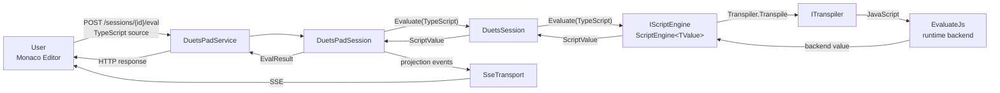
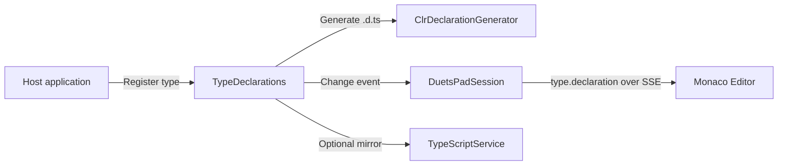

# DuetsPad Protocol

DuetsPad uses ordinary HTTP requests for bounded commands and one multiplexed server-sent-event stream for every
server-to-browser projection belonging to a session. The protocol is implemented by `Duets.Pad`; HttpHarker supplies
the underlying listener and routing pipeline.

This page owns transport shape and synchronization ordering. See [rendering and state](rendering-and-state.md) for the
meaning and lifetime of projected content, [security](security.md) for the request gate, and the
[DuetsPad architecture landing](README.md) for service and session ownership.

## Session routes

The service exposes an explicit session boundary:

| Route | Role |
|---|---|
| `POST /sessions` | Create a server-issued session |
| `DELETE /sessions/{sessionId}` | Dispose the session and all session-owned resources |
| `POST /sessions/{sessionId}/eval` | Evaluate TypeScript in the session |
| `POST /sessions/{sessionId}/complete` | Invoke a registered tagged-template completion provider |
| `GET /sessions/{sessionId}/events` | Subscribe to the multiplexed projection stream |
| `GET /sessions/{sessionId}/canvas` | Request a current Canvas snapshot for resynchronization |
| `POST /sessions/{sessionId}/interactions/{handlerId}/invoke` | Invoke a live server-side interaction |
| `POST /sessions/{sessionId}/fields/{fieldId}/commit` | Commit one browser field value |
| `/sessions/{sessionId}/attachments/...` | Stage, stream, commit, or cancel a revisioned file selection |

Unknown and disposed identifiers do not implicitly recreate a particular session. Identifiers are never reused, and
the registry applies one uniform unknown-session response to session-specific routes
([ADR-34](../../decisions/34_duetspad-session-ownership-and-isolation.md),
[ADR-38](../../decisions/38_duetspad-session-lifecycle.md)).

## Evaluation flow

`DuetsPadSession` owns the evaluation gate and Pad side effects, but delegates execution to `DuetsSession`. The core
session delegates to `IScriptEngine`; its `ScriptEngine<TValue>` implementation owns transpilation, backend
evaluation, and conversion to `ScriptValue`. Pad does not call `ITranspiler` or the backend runtime directly
([ADR-27](../../decisions/27_split-javascript-runtime-backends-from-duets-core.md),
[ADR-31](../../decisions/31_scriptengine-generic-backend-base-and-iscriptengine.md)).

The Pad evaluation gate serializes script execution with state-changing interaction and modal callbacks. Output side
effects such as `dump`, `console.*`, and Canvas mutations are committed to that same Pad session before their
projection messages are observed
([ADR-34](../../decisions/34_duetspad-session-ownership-and-isolation.md),
[ADR-41](../../decisions/41_duetspad-interaction-model.md)).

## One multiplexed SSE stream

All server-to-browser events for a session travel over `GET /sessions/{sessionId}/events`. A single stream avoids the
HTTP/1.1 per-origin connection pressure of one persistent connection per surface and makes replay ordering
deterministic. `SseTransport` owns response and keepalive mechanics; `DuetsPadSession` owns subscriber registration,
state capture, and fan-out
([ADR-36](../../decisions/36_duetspad-server-canonical-output-protocol.md)).

The stream uses namespaced event families:

- `canvas.snapshot`, `canvas.replace`, and `canvas.patch` project named Canvas state.
- `timeline.reset`, `timeline.append`, `timeline.update`, and `timeline.trim` project Timeline history.
- `modal.snapshot`, `modal.open`, `modal.patch`, `modal.replace`, and `modal.close` project active Modals.
- `type.declaration` updates Monaco's generated declaration libraries.
- `taggedTemplate.snapshot` replaces the set of tags eligible for the completion RPC.
- `control.*` carries imperative browser commands that are not retained projection state.

On subscription or reconnect, the session captures the current replay burst under its state lock: one
`canvas.snapshot` per named Canvas, then `timeline.reset`, `modal.snapshot`, declaration updates, and the registered-tag
snapshot when enabled. Later surface mutations retain their per-session order on the same channel
([ADR-36](../../decisions/36_duetspad-server-canonical-output-protocol.md),
[ADR-43](../../decisions/43_duetspad-named-multi-canvas.md),
[ADR-44](../../decisions/44_tagged-template-completion-rpc-boundary.md),
[ADR-52](../../decisions/52_duetspad-modal-surface.md)).

## Canvas revisions, patches, and resync

Each Canvas projection has its own monotonically advancing revision. A full snapshot or replacement establishes a
baseline. `canvas.patch` advances that revision by exactly one and carries positional operations plus the complete
visible interaction set. The server uses a conservative differ and sends a full replacement when a patch would not
be smaller
([ADR-45](../../decisions/45_duetspad-canvas-incremental-patch-protocol.md)).

The browser validates a patch completely before mutating its DOM projection. It rejects revision gaps, malformed
operations, invalid render nodes, or inconsistent interaction sets without partially applying them. A canvas-scoped
resync request obtains a snapshot with the same full-state shape; bounded buffering covers events that arrive while
that resync is in flight
([ADR-45](../../decisions/45_duetspad-canvas-incremental-patch-protocol.md)).

Named Canvases share these event types. Their messages include the Canvas name, and replay emits a snapshot for every
existing name. Session identity and Canvas identity are separate: resetting to a fresh session starts a new stream and
new Canvas revision sequences
([ADR-42](../../decisions/42_duetspad-pad-control-surface-and-command-channel.md),
[ADR-43](../../decisions/43_duetspad-named-multi-canvas.md)).

## Timeline and Modal projections

Timeline is append-oriented but remains server-canonical. `timeline.reset` replays its retained state, append and
update carry one entry, and trim removes entries before a stable id boundary. Entry ids remain monotonic across trims,
so reconnect and incremental projection converge without id reuse
([ADR-36](../../decisions/36_duetspad-server-canonical-output-protocol.md),
[ADR-39](../../decisions/39_duetspad-timeline-quota-policy.md)).

Modals use their own revisioned projection family. `modal.snapshot` replays the active ordered set; open, patch,
replace, and close update it incrementally. Result handling atomically claims a modal once before invoking its later
callback, preventing duplicate browser requests from completing the same modal twice
([ADR-52](../../decisions/52_duetspad-modal-surface.md)).

## Type declarations and tagged-template completions

Type declarations originate in the core session and are projected to Monaco without making the browser the owner of
the declaration store
([ADR-25](../../decisions/25_session-as-canonical-entry-point.md),
[ADR-36](../../decisions/36_duetspad-server-canonical-output-protocol.md)).

Tagged-template completion is a bounded RPC rather than part of the SSE request direction. Monaco tokenization and a
narrow browser helper decide when source position is inside a registered tag and send explicit segment context to
`POST /sessions/{sessionId}/complete`. The server validates the tag, accepts one normalized raw segment, enforces body,
text, result-count, rate, and callback-time limits, and validates segment-relative replacement spans. It does not add
a second server-side JavaScript parser
([ADR-44](../../decisions/44_tagged-template-completion-rpc-boundary.md)).

## Interactions and browser-written state

Rendered interactions expose only opaque handler ids. An invoke request may run a live handler or return `stale` when
the output that owned it has already been replaced, trimmed, closed, or disposed
([ADR-41](../../decisions/41_duetspad-interaction-model.md)).

Form controls are server-canonical state with the browser as a constrained second writer. The browser commits on
focus-out and also includes its current field snapshot in an invoke request. Under the evaluation gate, the server
commits that snapshot before reading the handler, eliminating the click-before-blur race without introducing HTML
form submission
([ADR-47](../../decisions/47_duetspad-form-input-state-model.md)).

Attachment revisions extend the same invoke precondition. A browser selection begins with a persisted browser-client
generation, reserves bounded staging, streams files individually, and commits the set atomically under an opaque
selection token. Before invoking a handler, the browser waits for its local uploads and sends the retained picker
revision snapshot; the server rejects pending, incomplete, or superseded selections under the evaluation gate. Failed
selections have a revision-conditioned cancellation path that remains safe after reload
([ADR-50](../../decisions/50_duetspad-file-attachment-state-and-upload-protocol.md)).

## Imperative control channel

The `pad` script global enqueues `control.*` commands such as reset, open-text, and set-editor-text. Commands produced
during an evaluation are buffered and flushed after the run while the evaluation gate is still held. Reset is
browser-driven and swaps to a newly created session rather than disposing the active engine during its own execution.
Open-text hands content off through a one-shot server key instead of putting text into a URL; set-editor-text is
set-only because the server has no live editor buffer
([ADR-42](../../decisions/42_duetspad-pad-control-surface-and-command-channel.md)).
