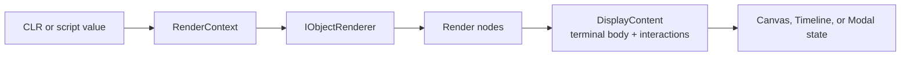

# DuetsPad Rendering and State

DuetsPad represents output as server-owned structured state. Rendering produces validated terminal nodes plus any
server-side interactions; Canvas, Timeline, and Modal retain those results and project them through the
[protocol](protocol.md). This page owns the meaning, authority, and lifetime of that state.

See the [DuetsPad architecture landing](README.md) for session ownership and the
[package guide](../../../src/Duets.Pad/README.md) for script-facing examples and available `ui.*` builders.

## Rendering pipeline

Object rendering starts with a `RenderContext` carrying per-call `DumpOptions`. The default limits are `MaxDepth=5`
and `MaxItems=1000`. Depth limiting and cycle detection occur in the central dispatch path so recursive custom
renderers cannot bypass them. Renderer resolution is session-scoped and last registration wins; the default renderer
classifies values by conceptual shape rather than accidental CLR marshaling type
([ADR-35](../../decisions/35_duetspad-rendering-model.md),
[ADR-40](../../decisions/40_duetspad-default-object-classification-policy.md)).

The pipeline reduces render nodes to terminal display nodes before state enters a projected surface. Its result is
`DisplayContent`: a terminal body plus pending interactions. The retained render-node tree remains display-only;
callback delegates live in the per-session interaction store rather than inside serializable nodes
([ADR-35](../../decisions/35_duetspad-rendering-model.md),
[ADR-41](../../decisions/41_duetspad-interaction-model.md)).

Raw HTML is an explicit terminal escape hatch. Browser projection validates render-node shape and applies the same
security policy to full replacements and incremental patches; ordinary text and first-class builders do not require
callers to own HTML or framework classes
([ADR-33](../../decisions/33_tabler-css-framework-for-duetspad.md),
[ADR-35](../../decisions/35_duetspad-rendering-model.md),
[ADR-45](../../decisions/45_duetspad-canvas-incremental-patch-protocol.md)).

## Dump ownership

`dump` belongs to DuetsPad rather than the core package. `dump(value)` renders to Timeline history and returns the
input. DuetsPad also installs a non-enumerable, type-preserving `value.dump()` method through layered runtime dispatch,
a generic-receiver TypeScript declaration, and a narrow Monaco completion provider. The global form remains the
fallback for nullish values, null-prototype objects, and values whose own member shadows the fluent method
([ADR-35](../../decisions/35_duetspad-rendering-model.md),
[ADR-53](../../decisions/53_fluent-dump-via-layered-runtime-typing-and-completion.md)).

Core Duets surfaces evaluation results and console events but does not define a dump sink. This keeps a structured
browser-output policy out of the runtime-neutral session abstraction
([ADR-20](../../decisions/20_dump-as-global-function-not-prototype-extension.md),
[ADR-27](../../decisions/27_split-javascript-runtime-backends-from-duets-core.md),
[ADR-35](../../decisions/35_duetspad-rendering-model.md)).

## Canvas

Canvas is persistent display state. Every session has a permanently addressable `"default"` Canvas exposed as
`canvas`; `canvases.get(name)` returns an existing named Canvas or creates it on first use. Each Canvas owns its
rendered tree and interaction set independently, and the browser presents names as Canvas tabs
([ADR-43](../../decisions/43_duetspad-named-multi-canvas.md)).

Canvas mutation commits a new immutable authoritative tree. Projection can use a conservative incremental patch, but
that transport optimization does not change Canvas ownership or node identity. A full replacement retires the old
Canvas interaction set and triggers reconciliation of fields and attachments that are no longer reachable from any
retained projected surface
([ADR-41](../../decisions/41_duetspad-interaction-model.md),
[ADR-47](../../decisions/47_duetspad-form-input-state-model.md),
[ADR-50](../../decisions/50_duetspad-file-attachment-state-and-upload-protocol.md),
[ADR-45](../../decisions/45_duetspad-canvas-incremental-patch-protocol.md)).

## Timeline

Timeline is ordered structured history. It owns dump and console entries, Immediate results, diagnostics, and
rendering errors rather than treating them as a browser-local log. Entries have monotonic ids and may be updated when
mutable projected content changes
([ADR-32](../../decisions/32_duetspad-supersede-replservice-with-new-output-model.md),
[ADR-36](../../decisions/36_duetspad-server-canonical-output-protocol.md)).

`TimelineEntryLimit` is an optional retained-entry quota; `null` means unlimited. After an append that exceeds the
limit, the server drops the oldest entries and projects append followed by trim. Ids are never reused, and removing an
entry retires its interaction set and slot placements, then prunes fields and attachments that are no longer reachable
from any retained projected surface
([ADR-39](../../decisions/39_duetspad-timeline-quota-policy.md),
[ADR-41](../../decisions/41_duetspad-interaction-model.md),
[ADR-47](../../decisions/47_duetspad-form-input-state-model.md),
[ADR-50](../../decisions/50_duetspad-file-attachment-state-and-upload-protocol.md)).

## Interactions

Builders such as `ui.button` render opaque handler ids into projected content while retaining delegates in the
session-owned `InteractionStore`. Rendering first produces pending interactions; committing output makes exactly the
corresponding set live. A handler is released when its owning Canvas content is replaced, its Timeline entry is
updated or trimmed, its Modal closes or changes, or the session is disposed. A browser request racing retirement gets
`stale` rather than invoking a detached delegate
([ADR-41](../../decisions/41_duetspad-interaction-model.md),
[ADR-52](../../decisions/52_duetspad-modal-surface.md)).

Handlers run under the same session evaluation gate as script evaluation. They can therefore read and mutate session
state without racing another state-changing turn, while the protocol performs field and attachment preconditions
before the delegate executes
([ADR-41](../../decisions/41_duetspad-interaction-model.md),
[ADR-47](../../decisions/47_duetspad-form-input-state-model.md),
[ADR-50](../../decisions/50_duetspad-file-attachment-state-and-upload-protocol.md)).

## Mutable slots

`ui.slot` is a session-bound handle whose `content` can be replaced after projection. The handle owns a stable marker
identity rendered as `data-duetspad-slot`. An update searches the authoritative Canvas trees, Timeline entries, and
active Modal trees for that marker instead of maintaining an identity-to-placement index. This tolerates intervening
tree edits, supports multiple placements, and requires no index invalidation when one placement disappears
([ADR-46](../../decisions/46_placement-discovery-for-mutable-projected-content.md),
[ADR-52](../../decisions/52_duetspad-modal-surface.md)).

Each located subtree is replaced and re-rendered through the existing surface path. Canvas may emit a patch or full
replacement; Timeline uses entry update; Modal uses its revisioned patch or replacement family. Interactions within
the replaced content are retired and recommitted with the new `DisplayContent`. Assigning an unplaced slot only
updates the handle's content because there is no authoritative placement to project.

## Form fields

Input handles store string values in a per-session field store keyed by handle identity. The browser is a constrained
second writer: it commits a value on focus-out and sends a complete visible-field snapshot with interaction requests.
Script-side `handle.value` reads and writes the same server-canonical store
([ADR-47](../../decisions/47_duetspad-form-input-state-model.md)).

Field values are strings without coercion or validation; checkbox values are `"True"` or `"False"`. A value can be
retained even when current options cannot display it. Values survive incremental patches, reconnect, and option-list
changes, but a full rebuild of the owning output retires them. Browser projection writes live DOM properties such as
`value`, `checked`, and `selectedIndex`, not only HTML attributes
([ADR-47](../../decisions/47_duetspad-form-input-state-model.md)).

## File attachments

`ui.filePicker` uses a dedicated attachment store rather than putting file data into the string field store. A
committed selection is server-canonical and revisioned. Browser generations and opaque selection tokens make rapid
reselection deterministic; staging streams each file without holding the evaluation gate, and commit replaces the
selection atomically
([ADR-50](../../decisions/50_duetspad-file-attachment-state-and-upload-protocol.md)).

Attachment retention follows rendered picker reachability across Canvas, Timeline, and Modal. Pruning before an
interaction removes abandoned speculative entries; replacing or retiring owning output eventually releases storage.
Quota remains charged until physical deletion succeeds, and transient deletion failures retry while the session is
live
([ADR-50](../../decisions/50_duetspad-file-attachment-state-and-upload-protocol.md)).

`openRead()` returns a path-hiding leased .NET stream. An open lease keeps its backing file alive until the stream is
disposed. `readAllText()` and `readAllBytes()` are bounded whole-file conveniences; under Jint, the byte path transfers
one owned allocation into a native `Uint8Array` through `ScriptByteBuffer`
([ADR-50](../../decisions/50_duetspad-file-attachment-state-and-upload-protocol.md),
[ADR-51](../../decisions/51_explicit-ownership-transfer-for-script-byte-buffers.md)).

Storage is pluggable with a temporary-file default and finite per-file bytes, per-session bytes, and per-session file
count. Session disposal drains storage through a background cleanup task and bounds the synchronous wait with
`AttachmentStorageDrainTimeout`; it does not force-dispose a storage provider against an outstanding operation.
Contained failures remain observable through `SessionDisposalErrorHandler`
([ADR-50](../../decisions/50_duetspad-file-attachment-state-and-upload-protocol.md)).

## Modals

Modal is a server-canonical projected surface because a synchronous script turn cannot wait for a later browser
choice. `ui.modal` opens content and returns immediately; a result callback executes in a later evaluation-gated turn
with a close reason and optional action id
([ADR-52](../../decisions/52_duetspad-modal-surface.md)).

Each active Modal owns its render tree, interactions, fields, slots, and attachments. The browser presents the active
ordered set as one accessible FIFO queue, while the server replays that set on reconnect. Result handling atomically
claims a Modal once, and close, reset, or session disposal retires all Modal-owned state. Body interactions can update
content without closing; configured footer actions and dismiss operations complete the Modal callback
([ADR-52](../../decisions/52_duetspad-modal-surface.md)).
