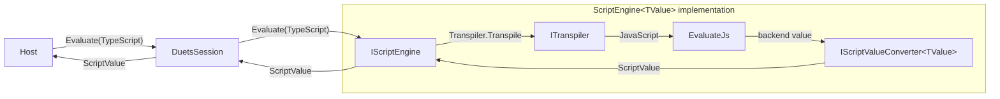

# Duets Architecture

[`Duets`](../../src/Duets/) is the runtime-neutral core package. It owns the session, declaration, transpilation, and
script-value contracts shared by all runtime backends. It does not reference Jint, HttpHarker, DuetsPad, or browser
assets
([ADR-27](../decisions/27_split-javascript-runtime-backends-from-duets-core.md),
[ADR-48](../decisions/48_extract-duets-pad-into-its-own-package.md)).

See the [architecture landing](README.md) for package boundaries and the [root README](../../README.md) for usage.

## Session ownership

- **`DuetsSession`** is the canonical host entry point and top-level lifetime
  ([ADR-25](../decisions/25_session-as-canonical-entry-point.md),
  [ADR-27](../decisions/27_split-javascript-runtime-backends-from-duets-core.md)). It owns `TypeDeclarations`, the active
  `ITranspiler`, an `IScriptEngine`, a `JsDocProviders` instance, and the tagged-template completion registry as one
  unit.
- **`DuetsSessionConfiguration`** accepts explicit engine and transpiler factories. When neither is supplied,
  `DuetsSession.CreateAsync` uses defaults registered by backend packages
  ([ADR-28](../decisions/28_unified-createasync-api-and-backend-autodiscovery.md)).
- **`DuetsBackendRegistry`** holds those default factories. Backend packages register them through module initializers,
  keeping backend discovery out of the core's static dependency graph
  ([ADR-28](../decisions/28_unified-createasync-api-and-backend-autodiscovery.md)).
- **The tagged-template registry** stores host completion callbacks independently of runtime installation. Registering
  a tag asks a capable backend to install its runtime function only when an evaluator is supplied
  ([ADR-44](../decisions/44_tagged-template-completion-rpc-boundary.md)).

## Execution contracts

- **`ITranspiler`** is the engine-neutral source-to-source boundary. Concrete implementations may run in a JavaScript
  backend or use a future implementation without changing the session contract
  ([ADR-10](../decisions/10_extract-itranspiler-interface-for-scriptengine.md),
  [ADR-27](../decisions/27_split-javascript-runtime-backends-from-duets-core.md)).
- **`IScriptEngine`** is the runtime-neutral execution boundary held by sessions and callers. `Execute` and `Evaluate`
  transpile before running, track `$_` and `$exception`, expose console events, and return `ScriptValue` rather than a
  backend-specific value
  ([ADR-27](../decisions/27_split-javascript-runtime-backends-from-duets-core.md),
  [ADR-31](../decisions/31_scriptengine-generic-backend-base-and-iscriptengine.md)).
- **`ScriptEngine<TValue>`** implements shared engine behavior around an `IScriptValueConverter<TValue>`. A backend
  supplies only its concrete execution, value-setting, wrapping, and unwrapping hooks
  ([ADR-31](../decisions/31_scriptengine-generic-backend-base-and-iscriptengine.md)).
- **`ScriptValue`** is the abstract runtime-neutral value wrapper. Backends provide concrete subclasses; comparisons
  support the core null and undefined sentinels and reject incompatible cross-backend values
  ([ADR-27](../decisions/27_split-javascript-runtime-backends-from-duets-core.md),
  [ADR-30](../decisions/30_scriptvalue-redesign-abstract-class-and-jstype.md)).

`DuetsSession` delegates the TypeScript source to `IScriptEngine`. The `ScriptEngine<TValue>` implementation owns the
transpile-then-evaluate orchestration: it invokes its `ITranspiler`, passes the resulting JavaScript to `EvaluateJs`,
and wraps the backend value as `ScriptValue`
([ADR-27](../decisions/27_split-javascript-runtime-backends-from-duets-core.md),
[ADR-31](../decisions/31_scriptengine-generic-backend-base-and-iscriptengine.md)).

## Type declarations and documentation

- **`TypeDeclarations`** is the thread-safe, transpiler-agnostic store for generated and raw TypeScript declarations
  ([ADR-25](../decisions/25_session-as-canonical-entry-point.md)). It owns CLR type registration, namespace
  placeholders, raw `.d.ts` registration, and change notifications. `ITypeDeclarationProvider` exposes snapshots and
  change events; `ITypeDeclarationRegistrar` exposes registration commands.
- **`ClrDeclarationGenerator`** reflects over CLR types to produce `.d.ts` declarations. It can ask an
  `IJsDocProvider` to annotate generated members with documentation
  ([ADR-8](../decisions/8_use-addextralib-to-inject-dts-declarations-for-completions.md),
  [ADR-29](../decisions/29_jsdoc-provider-abstraction.md)).
- **`JsDocProviders`** is an ordered composite of `IJsDocProvider` implementations. It takes the first non-null result,
  isolates provider failures, and notifies the session when a newly added provider requires declaration refresh
  ([ADR-29](../decisions/29_jsdoc-provider-abstraction.md)).
- **`XmlDocumentationProvider`** reads .NET XML documentation directly or extracts the best target-framework and
  assembly match from a cached NuGet package
  ([ADR-29](../decisions/29_jsdoc-provider-abstraction.md)).

Declaration changes can be consumed by a backend language service and by DuetsPad's browser projection without
putting either consumer into the core package. See [Duets.Jint](Duets.Jint.md) and the
[DuetsPad protocol](Duets.Pad/protocol.md).

## Explicit binary ownership

**`ScriptByteBuffer`** is a single-use ownership-transfer envelope for host-produced bytes. A backend may consume its
exclusively owned array as a native mutable script buffer without changing ordinary CLR array behavior or making a
defensive copy
([ADR-51](../decisions/51_explicit-ownership-transfer-for-script-byte-buffers.md)).
