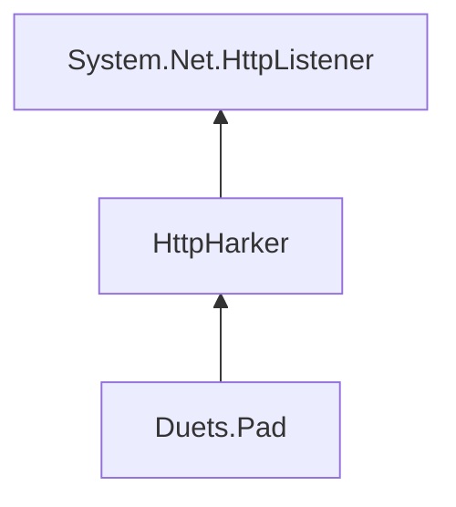

# HttpHarker Architecture

[`HttpHarker`](../../src/HttpHarker/) is a standalone lightweight HTTP server library built on
`System.Net.HttpListener`. It has no dependency on Duets and may be extracted to its own repository without changing
the dependency direction
([ADR-9](../decisions/9_wrap-httplistener-in-a-dedicated-middleware-library.md)).

The [HttpHarker package guide](../../src/HttpHarker/README.md) owns usage examples, built-in middleware behavior, and
the public type overview. This page records why the library exists and how it fits into the Duets architecture.

## Boundary

Duets needs HTTP routing, static-asset serving, server-sent events, and concurrent request handling without requiring
an embedding application to adopt ASP.NET Core's hosting and dependency model. `System.Net.HttpListener` provides the
base-class-library primitive; HttpHarker supplies the missing compositional layer
([ADR-3](../decisions/3_use-httplistener-instead-of-asp-net-core-kestrel.md),
[ADR-9](../decisions/9_wrap-httplistener-in-a-dedicated-middleware-library.md)).

HttpHarker remains general-purpose. It knows nothing about sessions, TypeScript, rendering, or DuetsPad. `Duets.Pad`
depends on HttpHarker and attaches `DuetsPadService` to an `HttpServer`; neither HttpHarker nor the core `Duets`
package depends on the pad
([ADR-9](../decisions/9_wrap-httplistener-in-a-dedicated-middleware-library.md),
[ADR-48](../decisions/48_extract-duets-pad-into-its-own-package.md)).

## Request pipeline

`HttpServer` owns the listener and concurrent worker loop. Requests enter a middleware pipeline in registration
order. Each middleware can handle and close the response or call the next delegate, allowing routing, embedded
resources, content-type detection, error pages, and an application such as DuetsPad to compose without a monolithic
request dispatcher
([ADR-9](../decisions/9_wrap-httplistener-in-a-dedicated-middleware-library.md)).

The abstraction remains deliberately thin: platform-specific `HttpListener` behavior is visible where necessary,
and the library does not reproduce the ASP.NET Core framework. This preserves the embeddability trade-off chosen by
[ADR-3](../decisions/3_use-httplistener-instead-of-asp-net-core-kestrel.md).

## Consumers

- `Duets.Pad` uses the pipeline for static assets and the session HTTP/SSE protocol. See
  [DuetsPad architecture](Duets.Pad/).
- Hosts can use HttpHarker independently. See the [package guide](../../src/HttpHarker/README.md) and
  [`samples/HttpHarker/`](../../samples/HttpHarker/).
