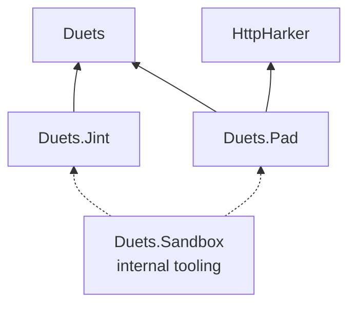

# Architecture

Duets is an embeddable TypeScript console for .NET
([ADR-2](../decisions/2_use-typescript-as-the-scripting-language.md)). A host application creates a runtime-neutral
session, selects a JavaScript backend, and may optionally expose that session through the DuetsPad browser interface.
This page gives the whole-repository view; follow the module links for current internal detail and the
[ADR index](../decisions/index.md) for decision rationale.

## Core constraints

The core `Duets` package is independent of a concrete JavaScript runtime. Runtime integrations such as `Duets.Jint`
depend on the core abstractions, not the other way around
([ADR-27](../decisions/27_split-javascript-runtime-backends-from-duets-core.md)).

The browser interface must not force ASP.NET Core or Kestrel into an embedding host. HTTP support uses the standalone
HttpHarker library on `System.Net.HttpListener`, preserving support for constrained hosts such as mobile applications
and game engines
([ADR-3](../decisions/3_use-httplistener-instead-of-asp-net-core-kestrel.md),
[ADR-9](../decisions/9_wrap-httplistener-in-a-dedicated-middleware-library.md)). DuetsPad is therefore a separate
package depending on both `Duets` and `HttpHarker`; the core carries neither the HTTP layer nor browser assets
([ADR-48](../decisions/48_extract-duets-pad-into-its-own-package.md)).

## Package and module boundaries

The solid arrows are NuGet dependencies. `Duets.Sandbox` is a non-packable developer tool and its dotted arrows are
solution references rather than public package relationships.

| Module | Responsibility | Architecture | User guidance |
|---|---|---|---|
| `Duets` | Runtime-neutral sessions, execution contracts, and type declarations | [Duets](Duets.md) | [Repository quick start](../../README.md#quick-start) |
| `Duets.Jint` | Jint runtime integration, transpilation, CLR interop, and completions | [Duets.Jint](Duets.Jint.md) | [Samples](../../samples/Duets/) |
| `Duets.Pad` | Browser debug pad, server-canonical UI state, and its HTTP/SSE boundary | [Duets.Pad](Duets.Pad/) | [DuetsPad guide](../../src/Duets.Pad/README.md) |
| `HttpHarker` | General-purpose lightweight HTTP server and middleware pipeline | [HttpHarker](HttpHarker.md) | [HttpHarker guide](../../src/HttpHarker/README.md) |
| `Duets.Sandbox` | End-to-end developer and agent verification CLI | This page | [Agent workflow](../../AGENTS.md#end-to-end-verification-with-duetssandbox) |

`DuetsSession` is the canonical host entry point. It owns runtime-neutral execution and declaration state while a
backend package supplies the concrete engine and transpiler. Backend module initializers can register defaults, so a
host referencing `Duets.Jint` can create a session without passing backend objects through the core API
([ADR-25](../decisions/25_session-as-canonical-entry-point.md),
[ADR-27](../decisions/27_split-javascript-runtime-backends-from-duets-core.md),
[ADR-28](../decisions/28_unified-createasync-api-and-backend-autodiscovery.md)). DuetsPad wraps one such session per
browser session and remains above the public core boundary rather than gaining access to core internals
([ADR-34](../decisions/34_duetspad-session-ownership-and-isolation.md),
[ADR-48](../decisions/48_extract-duets-pad-into-its-own-package.md)).

## Runtime assets and external code

Runtime-hosted TypeScript tooling and browser assets use pluggable asset sources. The default sources fetch selected
JavaScript, declarations, styles, and fonts from configured CDNs and may cache them locally; embedders can replace
those sources for offline or controlled deployments
([ADR-6](../decisions/6_fetch-and-cache-runtime-js-assets-from-cdn.md),
[ADR-18](../decisions/18_pluggable-asset-source-abstraction.md),
[ADR-37](../decisions/37_binary-first-iassetsource.md)). See [Duets.Jint](Duets.Jint.md) for compiler and language-service
ownership and [DuetsPad security](Duets.Pad/security.md) for the browser-asset trust boundary.

The current unpkg-backed defaults fetch `typescript.js`, the Monaco `loader.js`, and, when server-side completion
requires it, `lib.es5.d.ts`; their disk-cache lifetime is seven days. Browser UI assets follow their configured
`IAssetSource` policies rather than becoming core assembly dependencies
([ADR-6](../decisions/6_fetch-and-cache-runtime-js-assets-from-cdn.md),
[ADR-12](../decisions/12_language-service-host-rewrite-and-nolib.md),
[ADR-18](../decisions/18_pluggable-asset-source-abstraction.md)).

## Supporting repository areas

`Duets.Sandbox` is internal debugging infrastructure rather than a usage example or deliverable. Its batch mode gives
agents a JSONL interface to the initialized stack without background-process management
([ADR-11](../decisions/11_sandbox-multi-mode-debugging-cli.md),
[ADR-16](../decisions/16_samples-directory-and-sandbox-role-clarification.md)). Current invocations and operations are
documented in [AGENTS.md](../../AGENTS.md#end-to-end-verification-with-duetssandbox).

Runnable user examples live in package-grouped [`samples/`](../../samples/) as self-contained .NET file-based apps.
They are the recommended executable companion to the root quick start and are deliberately separate from Sandbox
internals
([ADR-16](../decisions/16_samples-directory-and-sandbox-role-clarification.md),
[ADR-48](../decisions/48_extract-duets-pad-into-its-own-package.md)).

## Packaging and versioning

The solution publishes four packages: `Duets`, `Duets.Jint`, `Duets.Pad`, and `HttpHarker`. Development snapshots use
package-specific path-filtered heights and only changed packages are packed, while a stable version tag publishes the
complete package set at one explicit version
([ADR-23](../decisions/23_ci-and-package-publishing.md),
[ADR-48](../decisions/48_extract-duets-pad-into-its-own-package.md),
[ADR-54](../decisions/54_independent-snapshot-versioning-for-nuget-packages.md)).

## Key dependencies

| Dependency | Architectural role |
|---|---|
| [Jint](https://github.com/sebastienros/jint) | Concrete JavaScript runtime behind `Duets.Jint` ([ADR-4](../decisions/4_use-jint-as-the-javascript-engine.md), [ADR-27](../decisions/27_split-javascript-runtime-backends-from-duets-core.md)) |
| `System.Net.HttpListener` | Base-class-library HTTP primitive wrapped by HttpHarker ([ADR-3](../decisions/3_use-httplistener-instead-of-asp-net-core-kestrel.md), [ADR-9](../decisions/9_wrap-httplistener-in-a-dedicated-middleware-library.md)) |
| [Nerdbank.GitVersioning](https://github.com/dotnet/Nerdbank.GitVersioning) | Package-specific snapshot versions and release metadata ([ADR-23](../decisions/23_ci-and-package-publishing.md), [ADR-54](../decisions/54_independent-snapshot-versioning-for-nuget-packages.md)) |

## Architecture pages

- [Duets](Duets.md)
- [Duets.Jint](Duets.Jint.md)
- [Duets.Pad](Duets.Pad/)
  - [Protocol](Duets.Pad/protocol.md)
  - [Rendering and state](Duets.Pad/rendering-and-state.md)
  - [Security](Duets.Pad/security.md)
- [HttpHarker](HttpHarker.md)

The overall documentation map starts at [`docs/README.md`](../README.md).
